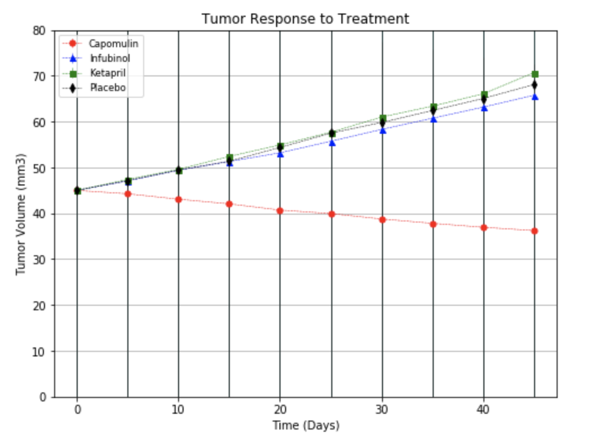
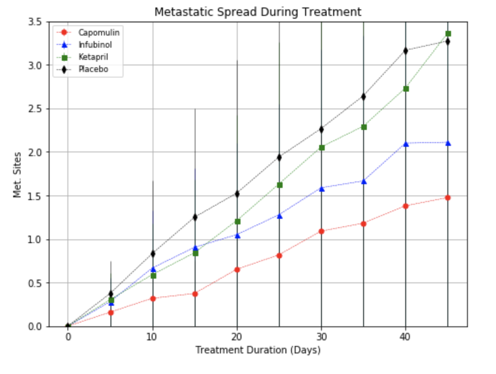
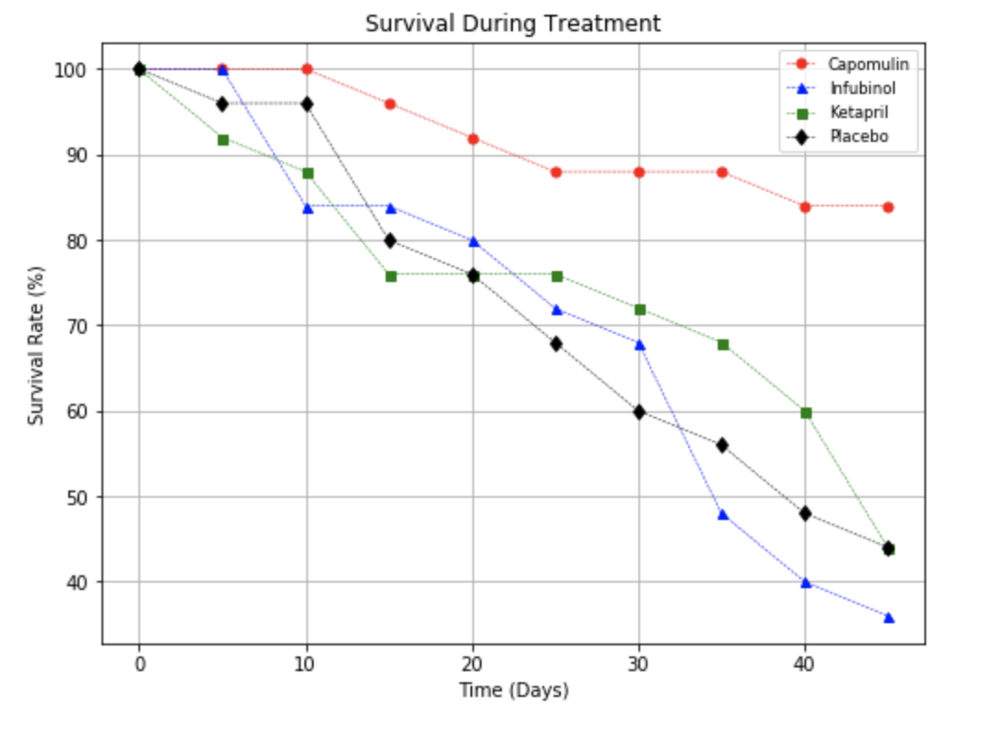
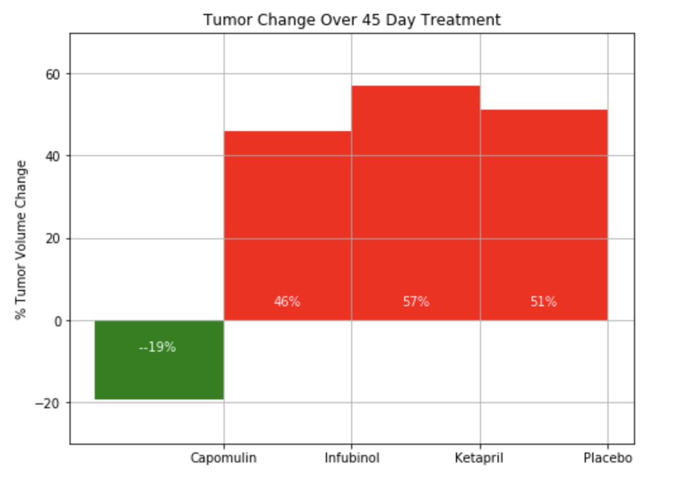

# Pharmaceutical-Company-Data-Analysis

## Purpose
The purpose of this project was to leverage the power of data analysis and data visualization to understand a pharma company's drugs. Using Pandas and Matplotlib, the visualization and analysis was done. 


## Objective
This dataset contained information on the most recent animal study. In this study, 250 mice were treated through a variety of drug regimes over the course of 45 days. Their physiological responses were then monitored over the course of that time. The objective is to analyze the data to show how four treatments `(Capomulin, Infubinol, Ketapril, and Placebo)` compare.

## Approach

```
1. Data Cleaning
    - Check for empty columns 
    - Drop the empty columns 
    - Check for repeat values
```

```
2. Perform Analysis 
    - 3 Scatter Plot 
    - 1 Bar Chart
```

```
3. Draw Conclusions 
    - Based on the analysis, summarize the conclusions. 
```

## Analysis & Metrics
**Scatter Plot: Tumor Response to Treatment** The point of this chart was aggregate the data on effect of `Capomulin, Infubinol, Ketapril, and Placebo` on the `volume of the tumor` over the course of the treatment.



**Scatter Plot: Metastatic Spread During Treatment** The point of this chart was aggregate the data on effect of `Capomulin, Infubinol, Ketapril, and Placebo` on the `metastatic (cancer spreading) of the tumor` over the course of the treatment.



**Scatter Plot: Survival During Treatment** The point of this chart was aggregate the data on effect of `Capomulin, Infubinol, Ketapril, and Placebo` on the `survival rate of the mice` over the course of the treatment.



**Bar Chart: % Tumor Volume Change** The point of this chart was aggregate the data on effect of `Capomulin, Infubinol, Ketapril, and Placebo` on the `overall size of the tumor` over the course of the treatment.



## Conclusions
* Overall, it is clear that Capomulin outperforms all other treatment options in the screen.
* Capomulin was the only treatment to reduce tumor volume. It held to a 19% reduction in tumor volume over the course of trial, whereas all other drugs were correlated with an increase in tumor volume by roughly 40-50%.
* Capomulin greatly limited the spread of the tumor compared to other treatment options. By study end, the average mouse on Capomulin had only 1 new metastatic site, as opposed to the average 2-3 found in mice of other treatment options.
* Lastly, mice on the Capomulin treatment had the highest survival rate of any treatment in the screen. Over 90% of mice treated by Capomulin survived the full duration of the trial, compared to only 35-45% of mice on other treatment options. 

## Advantages
* Using this data, Uber's marketing team can set prices that are normalized in all differenty type of cities.
* Moreover, the marketing team can then focus on increasing the amount of drivers in rural areas so the fare can get cheaper.
* The marketing team can further deep dive in to this data to target specific riders.